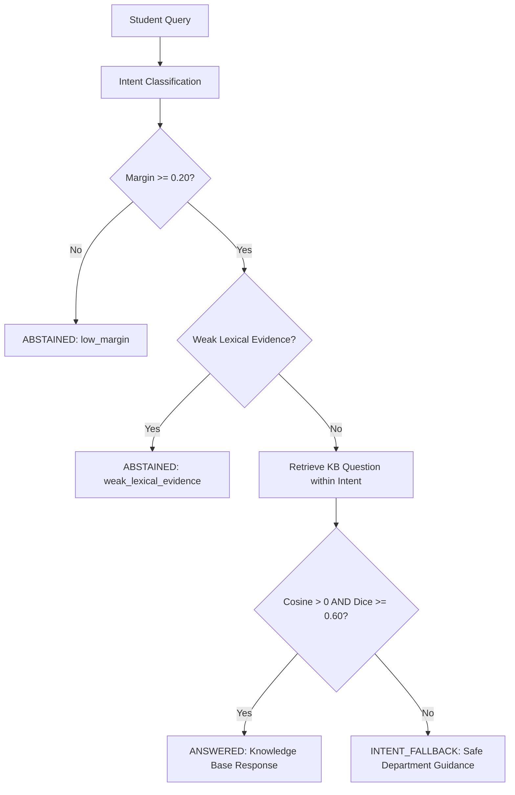

# HCL Student Support Chatbot

## Overview
The **HCL Student Support Chatbot** is a reliable, reproducible, and safety-oriented automated assistant designed to answer student support inquiries. Built on classical machine learning principles, the system pairs supervised multi-class intent classification with curated knowledge-base retrieval and a defensive three-tier safety gating policy.

The project emphasizes transparency, statistical honesty, and defensive design: in university administration, providing an incorrect answer or hallucinated policy detail is far more harmful than courteously admitting uncertainty. When evidence is ambiguous or incomplete, the chatbot is architected to abstain or fall back gracefully rather than risk misinforming a student.

> **Important Technical Note**: This system is **not** a Large Language Model (LLM) or generative conversational agent. It does not employ deep neural networks, generative AI, semantic vector databases, or Retrieval-Augmented Generation (RAG). It uses a deterministic TF-IDF representation paired with a Linear Support Vector Classifier (LinearSVC) and token-overlap retrieval over a curated institutional knowledge base.

---

## Project Objective
The primary objective of this project is to provide a reproducible, verified, and safe demonstration baseline for university student support routing and answer retrieval. 

Key design objectives include:
1. **Accurate Routing**: Classifying student questions into one of 26 fine-grained administrative and academic intents.
2. **Defensive Response Delivery**: Returning verified, pre-approved institutional answers only when evidence confirms a strong paraphrase match.
3. **Graceful Degradation**: Directing students to the appropriate functional department when the general intent is clear but specific question details are missing.
4. **Transparent Abstention**: Admitting uncertainty and directing students to human campus support when evidence is insufficient or queries are out of domain.
5. **Full Reproducibility**: Guaranteeing identical execution and verification across fresh environments via pinned dependencies, cryptographic artifact manifests, and comprehensive unit test coverage.

---

## Architecture

The system processes incoming student messages through a modular, feed-forward pipeline where classification evidence and retrieval candidates are evaluated together by a centralized safety policy.

```text
Student Message
       ↓
Text Cleaning (clean_text)
       ↓
TF-IDF Vectorization (TfidfVectorizer)
       ↓
Intent Classifier (LinearSVC)
       ↓
Intent + Confidence Signals (uncalibrated decision margin)
       ↓
Knowledge Base Retrieval (Cosine Similarity & Content Dice Overlap)
       ↓
Safety / Policy Gates (decide)
       ↓
Outcome: ANSWERED | INTENT_FALLBACK | ABSTAINED
```

The core layers operate as follows:
- **`src.ml.preprocessing`**: Standardizes raw text via lowercase folding, whitespace normalization, and trimming.
- **`src.ml.inference`**: Transforms normalized text using a saved TF-IDF vectorizer and computes class decision scores via Linear SVM. Extracts the uncalibrated margin between top-1 and top-2 predictions.
- **`src.ml.retrieval`**: Restricts search to historical knowledge-base entries matching the predicted intent, ranking candidates by cosine similarity and computing Dice overlap on non-stopword content tokens.
- **`src.ml.policy`**: The **sole decision-making authority** in the application. Inspects classifier margins, lexical coverage, and retrieval overlap to emit an immutable decision outcome.
- **`src.ml.pipeline`**: Orchestrates evidence gathering, resolves system version signatures, and formats the user-facing response.
- **`app.py`**: A thin Streamlit web interface that renders conversation history, outcome indicators, and technical diagnostics without duplicating any machine learning logic.

---

## Dataset

The system is trained and evaluated on an institutional interaction dataset located at:
```
data/raw/AI-Powered Chatbot.xlsx
```

### Dataset Characteristics
- **Total Records**: 200 interaction records.
- **Intent Classes**: 26 distinct categories covering academic policies, advising, campus facilities, financial aid, IT support, administration, and student life.
- **Class Distribution**: Severe class imbalance. Class support ranges from 24 examples for frequent categories (`campus_facilities`, `financial_aid`) down to **singleton classes** with only 1 example (`admissions`, `grades`, `academic_programs`, `study_abroad`, etc.).
- **Response Knowledge**: Exactly 200 unique institutional bot responses. Each knowledge base answer corresponds to exactly one question context; no two entries share identical canned text.

---

## Machine Learning Workflow

The machine learning workflow follows standard reproducible practices:
1. **Schema Validation**: `load_dataset()` verifies that all required columns (`User Message`, `Intent`, `Bot Response`) exist with 0 null values.
2. **Deterministic Partitioning**: `split_dataset()` performs an 80/20 train/test split (160 training rows, 40 test rows) using `random_state = 42`. Stratification is intentionally **not** applied because singleton classes cannot be partitioned into both train and test splits by `sklearn.model_selection.train_test_split`.
3. **Text Preprocessing**: Both splits are cleaned element-wise using `clean_text()`. Punctuation, numbers, and stopwords are preserved to maintain natural query syntax.
4. **Feature Extraction**: A `TfidfVectorizer` (unigrams and bigrams, default token pattern) is fitted strictly on the 160 training examples.
5. **Model Training**: Linear classifiers are trained on the resulting sparse numerical feature matrix ($N=160, D=602$).
6. **Honest Evaluation**: Models are benchmarked on the held-out test split ($N=40$) using Wilson score 95% confidence intervals, macro F1, and a majority baseline.

---

## Data Leakage Prevention

To prevent artificial inflation of evaluation metrics, strict feature boundaries are enforced at the configuration level (`FORBIDDEN_FEATURE_COLUMNS` in `src.ml.config`):

| Column Name | Role | Permitted as Feature? | Rationale / Leakage Risk |
| :--- | :--- | :---: | :--- |
| **`User Message`** | Model Feature | **YES (Sole Feature)** | The only text available from the student at inference time. |
| **`Intent`** | Target Label | **Target Only** | The ground-truth classification target. |
| **`Bot Response`** | Knowledge Base | **NO** | Contains the exact canned answer text. Using it as an input feature constitutes 100% artificial target leakage. |
| **`Intent Confidence`** | Metadata | **NO** | Post-interaction annotation from historical triage; unavailable at query time. |
| **`Topic`** | Metadata | **NO** | Coarse classification strongly correlated with Intent; constitutes target leakage. |
| **`Sentiment Score` / `Label`** | Metadata | **NO** | Post-interaction annotation; irrelevant and uninformative for intent classification. |
| **`User ID` / `Conversation ID` / `Timestamp`** | Metadata | **NO** | Session identifiers; causes classifiers to memorize user identity rather than language patterns. |

Furthermore, during full-pipeline retrieval evaluation, the retrieval knowledge base is strictly restricted to the 160 training examples (`train_df`). The test split questions and responses are completely excluded from the retriever to avoid **retrieval leakage**.

---

## Model Comparison

Three classical linear classifiers and a majority-class baseline were trained on the training partition ($N=160$) and evaluated on the canonical held-out test partition ($N=40$, seed 42):

| Model | Test Accuracy | 95% Wilson Confidence Interval | Macro F1 (Present Classes) | Macro F1 (All 26 Classes) | Weighted F1 | Selected? |
| :--- | :---: | :---: | :---: | :---: | :---: | :---: |
| **Linear SVM (`LinearSVC`)** | **0.500** (20/40) | **[0.352, 0.648]** | **0.334** | **0.231** | **0.510** | **YES** |
| **Logistic Regression** | 0.425 (17/40) | [0.285, 0.578] | 0.237 | 0.146 | 0.374 | No |
| **Multinomial Naive Bayes** | 0.375 (15/40) | [0.242, 0.530] | 0.120 | 0.074 | 0.287 | No |
| **Majority Baseline** | 0.175 (7/40) | [0.087, 0.320] | 0.019 | 0.011 | 0.052 | No |

*Candidate models were evaluated using `sklearn` defaults with fixed `random_state=42`. No synthetic oversampling, class reweighting, or hyperparameter optimization was applied.*

---

## Evaluation Results

### Canonical Split Analysis
While Linear SVM achieved **50.0% accuracy** on the canonical seed 42 test set, this metric must be interpreted in its proper scientific context:
- The total dataset consists of only 200 records across 26 distinct categories.
- The canonical test set contains only 40 examples ($N=40$).
- Due to extreme sparsity, **10 intent categories are absent from the test set** entirely (support = 0).
- As shown by the 95% Wilson confidence interval (`[0.352, 0.648]`), true generalization accuracy on this split is bounded between roughly 35% and 65%.
- Therefore, **50% accuracy must not be interpreted as evidence of a high-accuracy, production-ready classifier**.

### Supplementary Repeated-Split Analysis (30 Seeds)
To evaluate sensitivity to the train/test split, Phase 5B conducted an automated 30-seed repeated split evaluation (seeds 0 through 29):

| Model | Mean Accuracy | Std Dev | Min Accuracy | Median Accuracy | Max Accuracy | Best in Seed (Strict) | Best in Seed (Tied) |
| :--- | :---: | :---: | :---: | :---: | :---: | :---: | :---: |
| **Linear SVM** | **0.406** | **0.064** | **0.250** | **0.413** | **0.525** | **29 / 30** | **30 / 30** |
| **Logistic Regression** | 0.258 | 0.068 | 0.125 | 0.275 | 0.375 | 0 / 30 | 0 / 30 |
| **Multinomial NB** | 0.207 | 0.078 | 0.075 | 0.225 | 0.375 | 0 / 30 | 1 / 30 |

**Key Statistical Findings**:
1. **Linear SVM is consistently the strongest model**: It outperformed or tied all competing models across 100% of tested random splits (mean accuracy 40.6%).
2. **Canonical Seed 42 is an optimistic split**: Canonical seed 42's 50.0% accuracy sits in the top 10% of the split distribution (only 10% of seeds achieved $\ge 0.500$). 
3. **Class imbalance heavily impacts naive classification**: Models with smaller capacity or count-based priors frequently collapse towards high-frequency majority classes.

---

## Confidence and Abstention

Because linear classification on small text corpora exhibits moderate accuracy, the chatbot does not expose raw classifier predictions directly to students. Instead, predictions pass through a defensive safety policy (`src.ml.policy.decide`).

### Uncalibrated Classification Margin
The Linear SVM confidence signal is the **uncalibrated decision margin**:
$$\text{margin} = \text{score}_{\text{top-1}} - \text{score}_{\text{top-2}}$$
- The margin measures the distance between the two leading hyperplanes in TF-IDF space.
- It is **not** a calibrated probability.
- It is **never** presented as a probability or confidence percentage.

### Three-Tier Outcome Policy
The policy evaluates classifier margin, lexical in-vocabulary count, out-of-vocabulary (OOV) ratio, cosine similarity, and content-token Dice overlap, resulting in one of three possible outcomes:



1. **`ANSWERED`**:
   - The classifier margin meets the threshold ($\ge 0.20$), lexical evidence is sufficient, and the query matches a knowledge-base question with high cosine similarity and content-token Dice overlap ($\ge 0.60$).
   - *User Experience*: Returns the official canned response from the knowledge base.
   - *Example*: `"How can I connect to campus Wi-Fi?"` $\rightarrow$ `ANSWERED` (IT network instructions returned).
2. **`INTENT_FALLBACK`**:
   - The classifier has identified a plausible intent with sufficient margin, but retrieval finds no exact or close paraphrase match in the knowledge base.
   - *User Experience*: Returns structured departmental guidance without guessing specific facts:
     *"I think this is about financial aid, but I don't have enough information to give a reliable answer to that specific question yet."*
   - *Example*: `"How do I apply for financial aid?"` $\rightarrow$ `INTENT_FALLBACK`.
3. **`ABSTAINED`**:
   - The classifier margin is below threshold ($< 0.20$), lexical evidence is weak (e.g., out-of-vocabulary nonsense), or the input is empty.
   - *User Experience*: Refuses to answer and politely requests clarification or directs the student to campus support:
     *"I'm not sure what you're asking about. Could you rephrase or add a little more detail?"*
   - *Example*: `"xyzabc something completely unrelated"` $\rightarrow$ `ABSTAINED`.

> **Abstention is an intentional safety feature**: Abstaining when confidence is low prevents the bot from delivering misleading or incorrect advice regarding graduation, financial aid, or academic standing.

---

## Chatbot Response Pipeline

The response orchestrator is encapsulated in `src.ml.pipeline.ChatPipeline`. It serves as the single public entry point for both CLI and UI applications:

```python
from src.ml import answer

result = answer("How can I connect to campus Wi-Fi?")

print("Outcome:  ", result.outcome.value)   # 'answered'
print("Intent:   ", result.intent)          # 'technical_issue'
print("Margin:   ", result.margin)          # 1.2584 (uncalibrated)
print("Response: ", result.answer)          # 'Connect to Eduroam using your campus credentials...'
```

### Full-Pipeline Train-Only KB Evaluation
When evaluated over the 40 test queries against a leakage-free train-only knowledge base ($N=160$):
- **`ANSWERED` Rate**: 2.5% (1 query)
- **`INTENT_FALLBACK` Rate**: 52.5% (21 queries)
- **`ABSTAINED` Rate**: 45.0% (18 queries)
- **Committed Intent Accuracy**: 72.7% (16/22 correct among answered/fallback queries)
- **Wrong-Intent Answered**: **0 / 40 (0.0%)** (zero unsafe responses released)

---

## Project Structure

```
.
├── README.md                      # Comprehensive project documentation
├── app.py                         # Streamlit web application
├── requirements.txt               # Pinned runtime production dependencies
├── requirements-dev.txt           # Development and notebook dependencies
├── .gitignore                     # Git ignore rules protecting artifacts & caches
│
├── artifacts/                     # Committed canonical model artifacts
│   ├── intent_model.pkl           # Canonical LinearSVC model
│   ├── tfidf_vectorizer.pkl       # Canonical TF-IDF vectorizer
│   └── manifest.json              # SHA-256 cryptographic integrity manifest
│
├── data/
│   └── raw/
│       └── AI-Powered Chatbot.xlsx# Raw source dataset (200 rows, 26 intents)
│
├── docs/                          # In-depth architectural & safety documentation
│   ├── architecture.md            # System architecture, pipeline, and artifact flow
│   ├── model_card.md              # Machine learning model card and limitations
│   ├── phase4_inference_contract.md # Policy thresholds and evidence collection
│   └── phase5b_training_evaluation.md # Reproducible training methodology
│
├── notebooks/
│   └── hcl/
│       └── 01_hcl_student_support_workflow.ipynb # Educational walkthrough notebook
│
├── reports/                       # Deterministic evaluation reports
│   ├── canonical_classification_report.csv
│   ├── canonical_confusion_matrix.csv
│   ├── canonical_confusion_matrix.png
│   ├── canonical_model_comparison.csv
│   ├── evaluation_summary.json
│   ├── pipeline_evaluation.csv
│   ├── repeated_split_results.csv
│   └── repeated_split_summary.csv
│
├── src/                           # Centralized application source code
│   ├── chatbot.py                 # Interactive command-line chat interface
│   ├── eda.py                     # Initial exploratory data analysis script
│   ├── evaluate.py                # Deterministic evaluation CLI
│   ├── evaluate_confidence.py     # Confidence threshold analysis script
│   ├── train.py                   # Safe, non-destructive training CLI
│   ├── ml/                        # Core ML library modules
│   │   ├── __init__.py            # Clean public API exports
│   │   ├── artifacts.py           # Manifest generation & hash verification
│   │   ├── config.py              # Centralized paths, thresholds, and seeds
│   │   ├── data.py                # Dataset loading and deterministic splitting
│   │   ├── evaluation.py          # Honest metrics & repeated split analysis
│   │   ├── inference.py           # LinearSVC classification engine
│   │   ├── lexical.py             # Tokenization and lexical evidence analyzer
│   │   ├── pipeline.py            # Orchestrator and public answer() API
│   │   ├── policy.py              # Deterministic safety gating policy
│   │   ├── preprocessing.py       # Standard clean_text() normalizer
│   │   ├── retrieval.py           # Knowledge-base paraphrase retriever
│   │   ├── schemas.py             # Strongly-typed immutable dataclasses
│   │   └── training.py            # In-memory candidate model training
│   └── ui/                        # Streamlit presentation helpers
│       ├── __init__.py
│       └── helpers.py             # UI validation, copy text, diagnostics
│
└── tests/                         # Comprehensive unit test suite (112 tests)
    ├── test_artifacts.py          # Manifest & hash verification tests
    ├── test_data.py               # Dataset loading & splitting tests
    ├── test_evaluation.py        # Metrics, Wilson CIs, & equivalence tests
    ├── test_inference.py          # Classifier inference engine tests
    ├── test_lexical.py            # Lexical tokenizer and OOV tests
    ├── test_pipeline.py           # Full pipeline orchestration tests
    ├── test_policy.py             # Safety gating & outcome decision tests
    ├── test_retrieval_kb.py       # Knowledge base retriever & Dice overlap tests
    ├── test_training.py           # In-memory model training tests
    └── test_ui.py                 # UI input validation & diagnostics tests
```

---

## Installation

### Prerequisites
- Python 3.12 (tested on Python 3.12.3)
- Git

### Setup Instructions
1. **Clone the repository**:
   ```bash
   git clone https://github.com/Dipanshi1/ai_chatbot_system.git
   cd ai_chatbot_system
   ```

2. **Create and activate a virtual environment**:
   ```bash
   python3 -m venv .venv
   source .venv/bin/activate
   ```

3. **Install production dependencies**:
   ```bash
   python -m pip install --upgrade pip
   pip install -r requirements.txt
   ```

4. **Install development/notebook dependencies (optional)**:
   ```bash
   pip install -r requirements-dev.txt
   ```

---

## Running the Project

### Interactive CLI Chatbot
Run the interactive terminal chatbot:
```bash
python src/chatbot.py
```
To inspect technical decision evidence (margins, Dice overlap, shared tokens), run with `--debug`:
```bash
python src/chatbot.py --debug
```

### Safe In-Memory Training CLI
To train all candidate models in memory and view comparison metrics without writing anything to disk:
```bash
python src/train.py
```
> **Warning**: Never run `python src/train.py --save --overwrite` unless you explicitly intend to replace the canonical committed artifacts.

### Deterministic Evaluation CLI
To run canonical evaluation, repeated splits, and regenerate evaluation reports:
```bash
python src/evaluate.py
```

---

## Running Tests

Execute the complete automated unit test suite (112 unit tests):
```bash
python -m unittest discover -s tests -p "test_*.py" -v
```

All tests should pass cleanly without errors or warnings.

---

## Running the Notebook

An educational walkthrough notebook is provided at `notebooks/hcl/01_hcl_student_support_workflow.ipynb`.

To start the Jupyter server:
```bash
jupyter notebook notebooks/hcl/01_hcl_student_support_workflow.ipynb
```

The notebook:
- Explains the complete HCL student support workflow step by step.
- Reuses the centralized production code in `src/ml/`.
- Executes candidate model training entirely in memory.
- Verifies that in-memory training matches committed production artifacts 40/40.
- Never mutates canonical files on disk.

---

## Streamlit Application

Launch the Streamlit web interface:
```bash
streamlit run app.py
```

### Features of the Web Interface:
- **Clean Student UI**: Intuitive question-and-answer interface with conversation history.
- **Safety Indicators**: Clearly signals whether an answer is an official canned match, general intent guidance, or an abstention.
- **Input Guardrails**: Rejects empty queries and limits input length to 500 characters.
- **Diagnostics Panel**: An expandable drawer displaying uncalibrated decision margin, cosine similarity, content-token overlap, and model version.
- **Independence Disclaimer**: Prominently notes that each user question is evaluated independently (no multi-turn state tracking).

---

## Reproducibility

The project enforces reproducibility through multiple layers:

1. **Pinned Dependencies**: Exact package versions are pinned in `requirements.txt` (`scikit-learn==1.9.1`, `pandas==3.0.6`, `numpy==2.5.3`, etc.).
2. **Deterministic Random Seeds**: Data splitting (`SPLIT_RANDOM_STATE = 42`) and model initialization (`MODEL_RANDOM_STATE = 42`) are strictly fixed.
3. **Cryptographic Manifest**: Artifact integrity is governed by `artifacts/manifest.json`. The SHA-256 hashes of canonical files are:
   - `artifacts/intent_model.pkl`: `a473f4580f168c0ef0c7ea0c4812c4b1ca94aebce9f107d25d442c5fb30fa211`
   - `artifacts/tfidf_vectorizer.pkl`: `5f62a51adde831fbc634872c95672fd403d50b9c715266376315731d4de250f7`
   - `artifacts/manifest.json`: `307d34fd6f41f414cfa38c12ea67057bfc91325a4920c5dada8b6d5e1e40fe91`
4. **Automated Verification**: Running `from src.ml.artifacts import verify_artifacts; verify_artifacts()` programmatically validates all files against the manifest on application startup.

---

## Limitations

- **Small Sample Size**: The dataset contains only 200 interaction examples across 26 classes, resulting in wide confidence intervals and high variance across data splits.
- **Class Imbalance & Singletons**: Several intents possess only 1 or 2 examples, preventing stratified splitting and limiting minority-class generalization.
- **Uncalibrated Confidence**: SVM decision margins are geometric distances, not calibrated probabilities.
- **Static Knowledge Base**: Canned responses reflect a static snapshot of university policies and will become outdated if campus regulations change.
- **No Conversational Memory**: The system evaluates each query independently and cannot maintain context across multi-turn dialogues.
- **Paraphrase Dependency**: Retrieval relies on lexical token overlap and cosine similarity; queries using novel vocabulary absent from the training set cannot be answered directly.

---

## Future Improvements

Potential enhancements planned for future phases (Stage B):
1. **Data Expansion**: Systematically collecting diverse paraphrases for all 26 intent categories, ensuring a minimum support of 10 examples per class.
2. **Probability Calibration**: Fitting Platt scaling or isotonic regression on cross-validation folds to produce true calibrated probabilities.
3. **Hierarchical Routing**: Grouping sparse fine-grained intents into coarse department areas to improve fallback routing accuracy.
4. **Dynamic Knowledge Base**: Decoupling the knowledge base from static Excel files into an auditable document store.
5. **Contextual Memory**: Adding multi-turn session tracking for clarifying questions.

---

## Disclaimer

This chatbot is an educational demonstration baseline developed for university student support routing research. **It is not an authoritative source of university policy, academic regulations, or legal decisions.** Students should always confirm official requirements, graduation criteria, and financial deadlines directly with university academic advisors and department offices.
